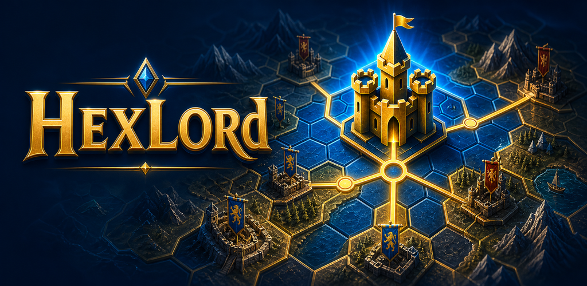

# HexLord

**HexLord** is an online hex-based strategy and conquest game where every move matters.

Expand your territory, manage your economy, defend your borders, control the seas, and outplay real opponents in fast tactical multiplayer matches.

Play now: [https://hexlord.com](https://hexlord.com)

---

## Overview

HexLord is a competitive strategy game built around clean tactical decision-making and readable map control.

Players compete on a hex-based map by conquering territory, protecting provinces, growing their economy, and applying pressure at the right moment. Every decision affects your position, resources, and long-term survival.

Whether you prefer tense one-on-one duels, chaotic free-for-all matches, or larger team battles, HexLord is designed to be fast, strategic, and easy to understand without losing tactical depth.

---

## Key Features

- **Online Multiplayer**  
  Play against real opponents in live tactical matches.

- **Hex-Based Strategy Gameplay**  
  Make meaningful movement, expansion, and positioning decisions on a clean hex map.

- **Territory Conquest**  
  Expand your control by capturing new provinces and strengthening your borders.

- **Economy Management**  
  Build your strength over time and make smart resource decisions.

- **Defensive Planning**  
  Protect your provinces, prepare against attacks, and hold key positions.

- **Free-for-All and Team Battles**  
  Compete alone or coordinate with allies in larger strategic conflicts.

- **Naval Gameplay**  
  Use ships, coastal pressure, and sea control to influence the battlefield.

- **Web and Mobile Support**  
  Enjoy a smooth gameplay experience across desktop and mobile browsers.

---

## Gameplay

In HexLord, victory comes from smart expansion, timing, and positioning.

You will need to:

- conquer nearby territory
- defend vulnerable provinces
- grow your economy
- watch enemy movement
- control important land and coastal areas
- decide when to attack, defend, or expand
- adapt your strategy against real players

The game rewards careful planning, efficient moves, and tactical awareness.

---

## Game Modes

HexLord supports multiple multiplayer formats:

- **1v1 Matches**
- **Free-for-All Battles**
- **Team-Based Matches**

Each mode creates a different strategic challenge, from direct duels to unpredictable multi-player conflicts.

---

## Play Online

The live version of HexLord is available here:

[https://hexlord.com](https://hexlord.com)

No installation is required. Open the game in your browser and start playing.

---
## Screenshot



## Why HexLord?

HexLord focuses on strategy without unnecessary complexity.

The goal is to create a game that is:

- easy to learn
- fast to play
- competitive
- tactical
- readable
- rewarding for smart decisions

Every match is shaped by player choices, territory control, and timing.

---

## Project Status

HexLord is actively available online and playable at:

[https://hexlord.com](https://hexlord.com)

Future updates may include new maps, improved balance, additional gameplay systems, and expanded multiplayer features.

---

## Community

If you enjoy tactical strategy games, territory control, conquest gameplay, and competitive multiplayer battles, HexLord is made for you.

Share the game with friends, follow the project, and join the battle:

[https://hexlord.com](https://hexlord.com)

---

## Contributing

Contributions, feedback, and suggestions are welcome.

If you find a bug, have an idea, or want to help improve HexLord, feel free to open an issue or submit a pull request.

---

## License

This project’s license information can be added here.

```md
MIT License
```

---

## Links

- **Play HexLord:** [https://hexlord.com](https://hexlord.com)
- **Website:** [https://hexlord.com](https://hexlord.com)

---

## HexLord

Conquer. Defend. Expand. Outplay.
